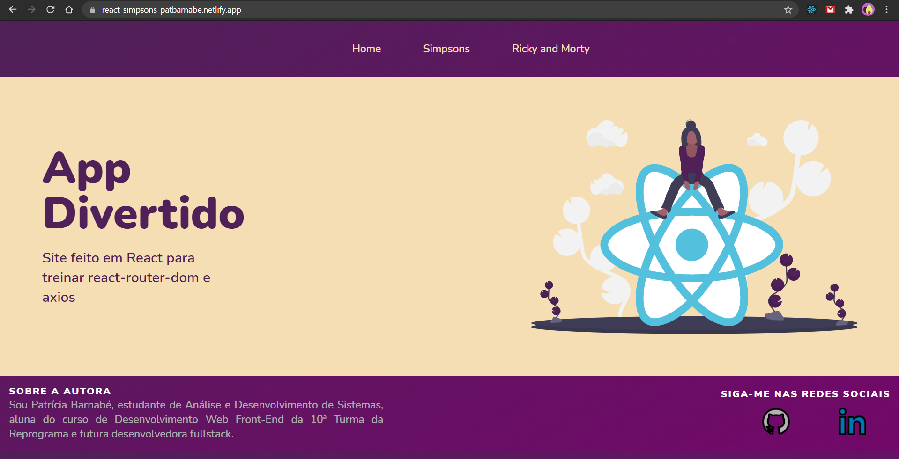
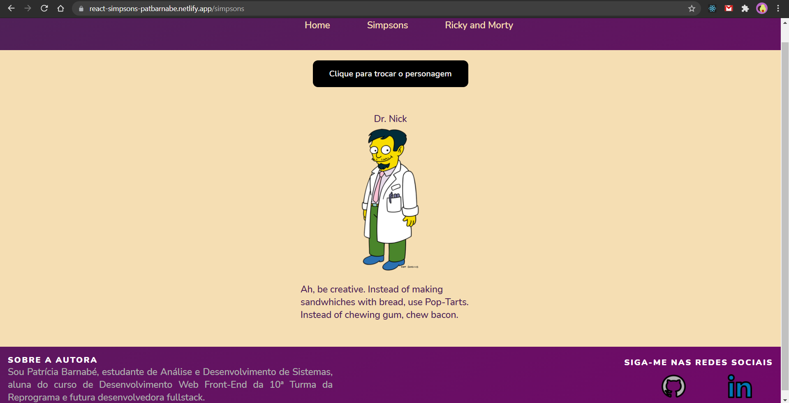
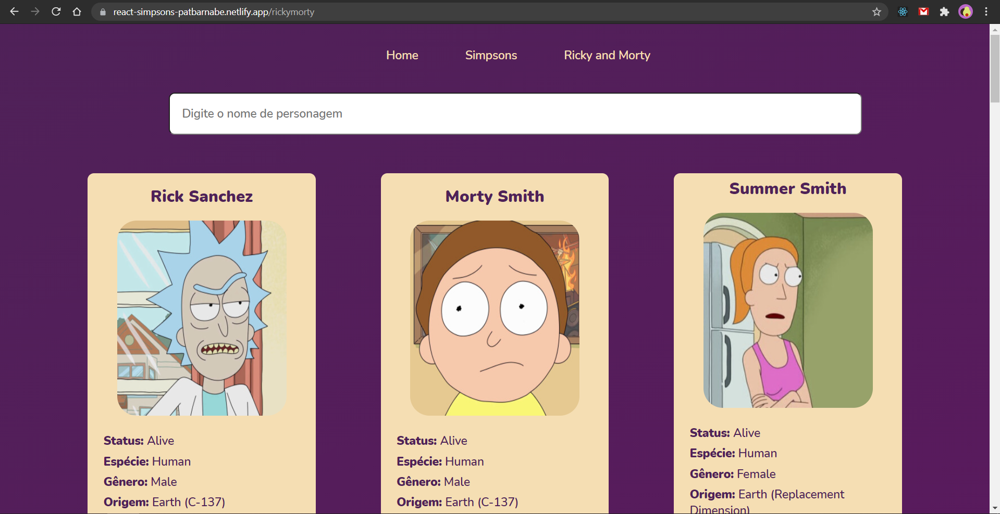

<h1 align="center">Reprograma 💜 Todas Em Tech - Projeto To Do List </h1>

10ª Turma | Front-end | maio 2021 

## Índice

1. [Objetivos](#dart-objetivos)
2. [Principais Aprendizados](#books-principais-aprendizados)
3. [Tecnologias Utilizadas](#robot-tecnologias-utilizadas)
4. [Resultado](#%EF%B8%8F-resultado)
5. [Sobre a Desenvolvedora](#-sobre-a-desenvolvedora)

---

### :dart: Objetivos 

Criar um projeto  single page application (SPA) em React para treinar react-router-dom e axios, consumir uma API externa, criar um componente Footer. Criar também uma nova página, consumindo outra API externa ou arquivo interno que simule um JSON, renderizando cards na tela com (img, titulo e descricao), além disso deve permitir uma busca por input atualizando os cards na tela de acordo com o que for digitado.
O objetivo é ter um front-end responsivo que consuma apis e nos permita interagir com as informações.

---
### :books: Principais Aprendizados

* BrowserRouter
* Switch e Route
* Link, NavLink e Redirect
* CSS na arquitetura de pastas 
* Axios

---

## :robot: Tecnologias Utilizadas

| Ferramenta | Descrição |
| --- | --- |
| `React` | Uma biblioteca JavaScript para criar interfaces de usuário |
| `HTML 5` | Linguagem de marcação |
| `CSS 3` | Linguagem de estilização |
| `JavaScript` |  Linguagem de programação interpretada estruturada |
| `Node.js` | Software de execução de códigos JavaScript |
| `Git e GitHub` | Sistemas de controle de versões distribuídos |

---
### ✔️ Resultado

---

## 👩‍💻 Sobre a Desenvolvedora
### Patrícia Barnabé

- [LinkedIn](https://www.linkedin.com/in/patriciabarnabe)
- E-mail: patbarnabe5@gmail.com
